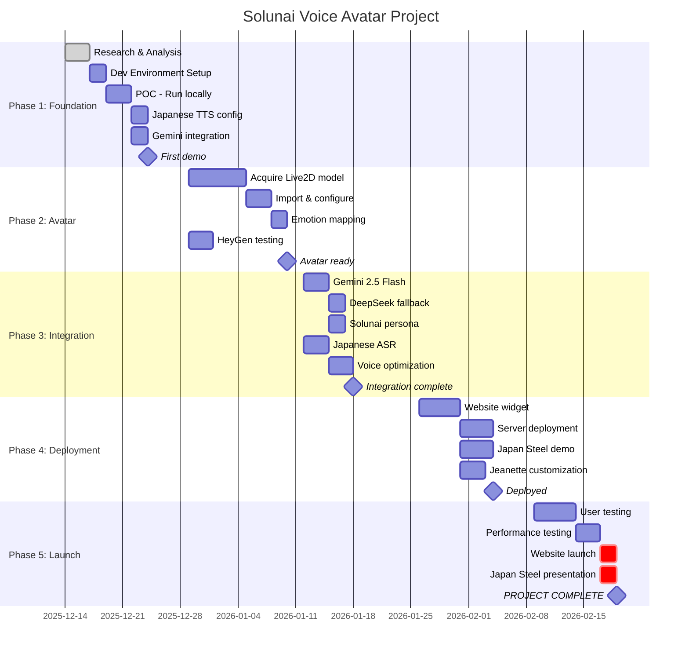

# PROJECT PLAN - SOLUNAI VOICE AVATAR

## Project Timeline: December 2025 - February 2026

---

## PHASE 1: FOUNDATION (Week 1-2)
**Target: December 14-28, 2025**

### 1.1 Research & Setup
| ID | Task | Subtasks | Dependencies | Owner | Status | Est. Hours |
|----|------|----------|--------------|-------|--------|------------|
| 1.1.1 | Clone & analyze Open-LLM-VTuber | - Clone repo<br>- Study architecture<br>- Document components | None | Tiger | DONE | 4 |
| 1.1.2 | Clone & analyze Genie (Gemini Voice) | - Clone repo<br>- Study WebSocket protocol<br>- Document API | None | Tiger | DONE | 4 |
| 1.1.3 | Research Live2D models | - Find tiger/mascot models<br>- Check licensing<br>- Evaluate quality | None | Tiger | TODO | 3 |
| 1.1.4 | Research talking photo APIs | - HeyGen API<br>- D-ID API<br>- Pricing comparison | None | Tiger | DONE | 2 |
| 1.1.5 | Set up development environment | - Python env<br>- Node.js<br>- API keys | 1.1.1 | Tiger | TODO | 2 |

### 1.2 Proof of Concept
| ID | Task | Subtasks | Dependencies | Owner | Status | Est. Hours |
|----|------|----------|--------------|-------|--------|------------|
| 1.2.1 | Run Open-LLM-VTuber locally | - Install dependencies<br>- Configure TTS<br>- Test with sample model | 1.1.5 | Tiger | TODO | 4 |
| 1.2.2 | Configure Japanese TTS | - Test Edge TTS Japanese<br>- Test Azure TTS<br>- Compare quality | 1.2.1 | Tiger | TODO | 3 |
| 1.2.3 | Connect to Gemini brain | - API key setup<br>- Test conversation<br>- Evaluate latency | 1.2.1 | Tiger | TODO | 3 |
| 1.2.4 | First talking avatar demo | - Record demo video<br>- Share with Papai | 1.2.2, 1.2.3 | Tiger | TODO | 2 |

---

## PHASE 2: AVATAR DEVELOPMENT (Week 3-4)
**Target: December 29 - January 11, 2026**

### 2.1 Live2D Avatar
| ID | Task | Subtasks | Dependencies | Owner | Status | Est. Hours |
|----|------|----------|--------------|-------|--------|------------|
| 2.1.1 | Acquire Tiger Live2D model | - Commission artist OR<br>- Find existing model<br>- Verify license | 1.1.3 | Carlos/Tiger | TODO | 8 |
| 2.1.2 | Import model to system | - Convert format if needed<br>- Test lip sync<br>- Configure expressions | 2.1.1, 1.2.1 | Tiger | TODO | 4 |
| 2.1.3 | Customize emotions | - Map emotions to expressions<br>- Test with conversations | 2.1.2 | Tiger | TODO | 3 |

### 2.2 Talking Photo Option
| ID | Task | Subtasks | Dependencies | Owner | Status | Est. Hours |
|----|------|----------|--------------|-------|--------|------------|
| 2.2.1 | Create HeyGen account | - Sign up<br>- Get API access<br>- Test free tier | None | Tiger | TODO | 1 |
| 2.2.2 | Test with Tiger image | - Upload mascot image<br>- Generate test video<br>- Evaluate quality | 2.2.1 | Tiger | TODO | 2 |
| 2.2.3 | Test with real photo | - Test with Papai photo<br>- Japanese voice sync | 2.2.1 | Tiger | TODO | 2 |

---

## PHASE 3: BRAIN & VOICE INTEGRATION (Week 5-6)
**Target: January 12-25, 2026**

### 3.1 LLM Backend
| ID | Task | Subtasks | Dependencies | Owner | Status | Est. Hours |
|----|------|----------|--------------|-------|--------|------------|
| 3.1.1 | Gemini 2.5 Flash integration | - Configure API<br>- System prompt<br>- Test Japanese | 1.2.3 | Tiger | TODO | 4 |
| 3.1.2 | DeepSeek fallback | - API setup<br>- Cost comparison<br>- Quality test | 3.1.1 | Tiger | TODO | 3 |
| 3.1.3 | Create Solunai persona | - Write system prompt<br>- Define personality<br>- Japanese politeness | 3.1.1 | Tiger | TODO | 3 |

### 3.2 Voice Pipeline
| ID | Task | Subtasks | Dependencies | Owner | Status | Est. Hours |
|----|------|----------|--------------|-------|--------|------------|
| 3.2.1 | Japanese ASR setup | - Whisper Japanese<br>- Test accuracy | 1.2.1 | Tiger | TODO | 3 |
| 3.2.2 | Japanese TTS quality | - Voice selection<br>- Speed/pitch tuning | 1.2.2 | Tiger | TODO | 3 |
| 3.2.3 | Real-time latency optimization | - Measure end-to-end<br>- Optimize pipeline | 3.2.1, 3.2.2 | Tiger | TODO | 4 |

---

## PHASE 4: DEPLOYMENT (Week 7-8)
**Target: January 26 - February 8, 2026**

### 4.1 Web Integration
| ID | Task | Subtasks | Dependencies | Owner | Status | Est. Hours |
|----|------|----------|--------------|-------|--------|------------|
| 4.1.1 | Solunai website widget | - Embed avatar<br>- Style to match site<br>- Mobile responsive | 2.1.2, 3.1.3 | Tiger | TODO | 8 |
| 4.1.2 | HTTPS configuration | - SSL certificate<br>- Secure WebSocket | 4.1.1 | Tiger | TODO | 2 |
| 4.1.3 | Server deployment | - Cloud GPU setup<br>- Docker container<br>- Monitoring | 4.1.1 | Tiger | TODO | 6 |

### 4.2 Client Demos
| ID | Task | Subtasks | Dependencies | Owner | Status | Est. Hours |
|----|------|----------|--------------|-------|--------|------------|
| 4.2.1 | Japan Steel demo | - Custom persona<br>- Industry knowledge<br>- Demo video | 3.1.3, 4.1.1 | Tiger | TODO | 6 |
| 4.2.2 | Jeanette's requirements | - Gather requirements<br>- Customize for her use | 4.1.1 | Tiger/Jeanette | TODO | 4 |

---

## PHASE 5: POLISH & LAUNCH (Week 9-10)
**Target: February 9-22, 2026**

### 5.1 Testing & QA
| ID | Task | Subtasks | Dependencies | Owner | Status | Est. Hours |
|----|------|----------|--------------|-------|--------|------------|
| 5.1.1 | User testing | - Internal testing<br>- Gather feedback<br>- Fix issues | 4.1.3 | Team | TODO | 8 |
| 5.1.2 | Performance testing | - Load testing<br>- Latency benchmarks | 5.1.1 | Tiger | TODO | 4 |

### 5.2 Launch
| ID | Task | Subtasks | Dependencies | Owner | Status | Est. Hours |
|----|------|----------|--------------|-------|--------|------------|
| 5.2.1 | Solunai website launch | - Final deployment<br>- Announcement | 5.1.1 | Carlos | TODO | 2 |
| 5.2.2 | Japan Steel presentation | - Prepare demo<br>- Present to client | 4.2.1, 5.1.1 | Carlos/Tiger | TODO | 4 |

---

## GANTT CHART



---

## DEPENDENCIES GRAPH

```
1.1.1 (Clone Open-LLM-VTuber)
  └── 1.1.5 (Dev environment)
        └── 1.2.1 (Run locally)
              ├── 1.2.2 (Japanese TTS)
              │     └── 3.2.2 (TTS quality)
              │           └── 3.2.3 (Latency optimization)
              └── 1.2.3 (Gemini brain)
                    └── 3.1.1 (Gemini 2.5 Flash)
                          ├── 3.1.2 (DeepSeek fallback)
                          └── 3.1.3 (Solunai persona)
                                └── 4.1.1 (Website widget)
                                      ├── 4.1.2 (HTTPS)
                                      ├── 4.1.3 (Server)
                                      ├── 4.2.1 (Japan Steel)
                                      └── 4.2.2 (Jeanette)

1.1.3 (Research Live2D)
  └── 2.1.1 (Acquire model)
        └── 2.1.2 (Import model)
              └── 2.1.3 (Emotions)
                    └── 4.1.1 (Website widget)
```

---

## MILESTONES

| ID | Milestone | Target Date | Deliverable | Status |
|----|-----------|-------------|-------------|--------|
| M1 | First Demo | Dec 25, 2025 | Working avatar with Japanese voice | TODO |
| M2 | Avatar Ready | Jan 11, 2026 | Custom Tiger Live2D integrated | TODO |
| M3 | Integration Complete | Jan 25, 2026 | Full voice pipeline working | TODO |
| M4 | Deployed | Feb 8, 2026 | Live on Solunai website | TODO |
| M5 | Project Complete | Feb 22, 2026 | All deliverables ready | TODO |

---

## RISK REGISTER

| Risk | Impact | Likelihood | Mitigation |
|------|--------|------------|------------|
| Live2D model licensing issues | High | Medium | Verify license before purchase; have backup options |
| Japanese TTS quality insufficient | Medium | Low | Multiple TTS options available; can upgrade to Azure |
| Latency too high for real-time | High | Medium | Use edge deployment; optimize pipeline |
| Budget overrun | Medium | Low | Most tools are free/low-cost; monitor closely |
| HPC funds used for voice project | Critical | Low | Strict budget cap at ¥1M for voice project |

---

## WEEKLY CHECK-INS

Every Sunday:
1. Review progress against plan
2. Update task statuses
3. Identify blockers
4. Adjust timeline if needed

---

*Last Updated: December 14, 2025*
*Project Manager: Tiger*
